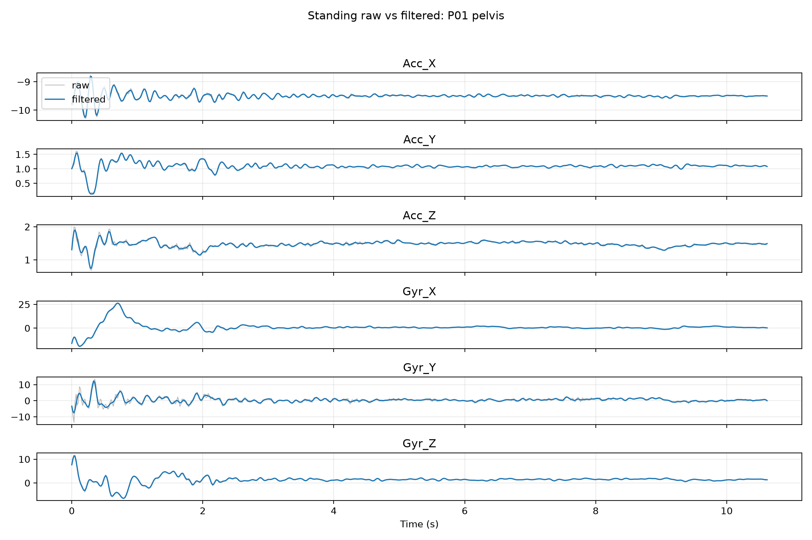
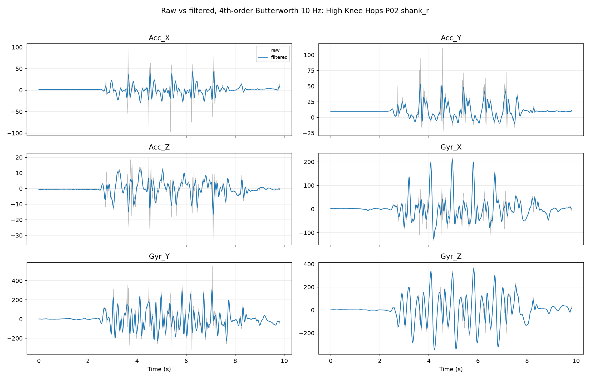
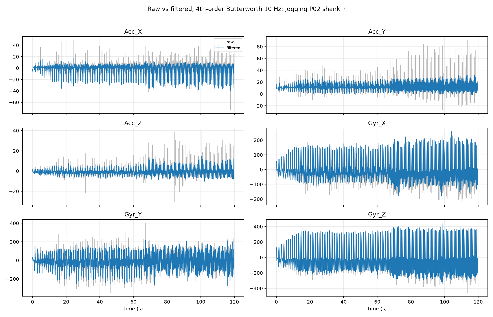
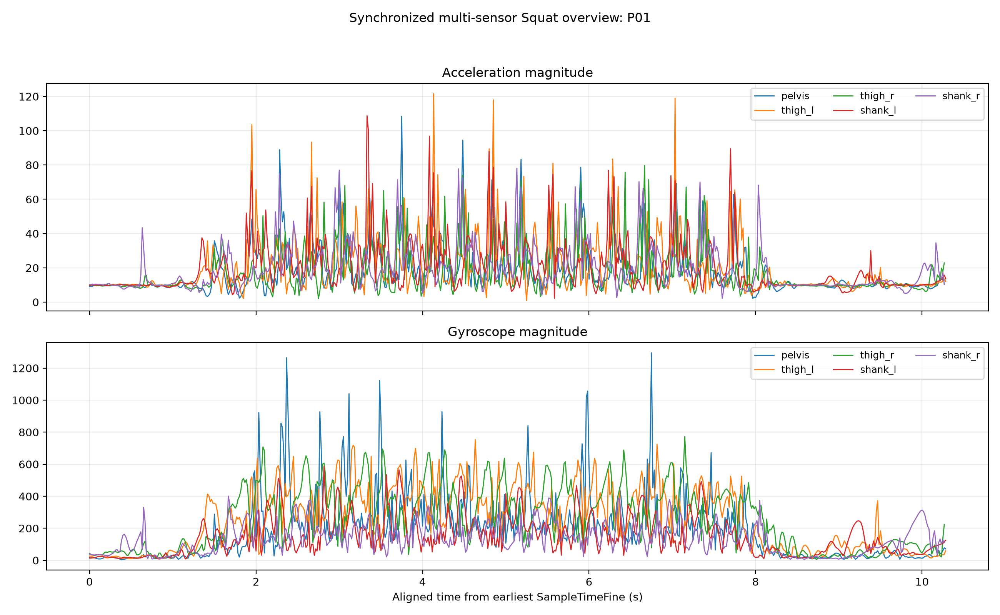
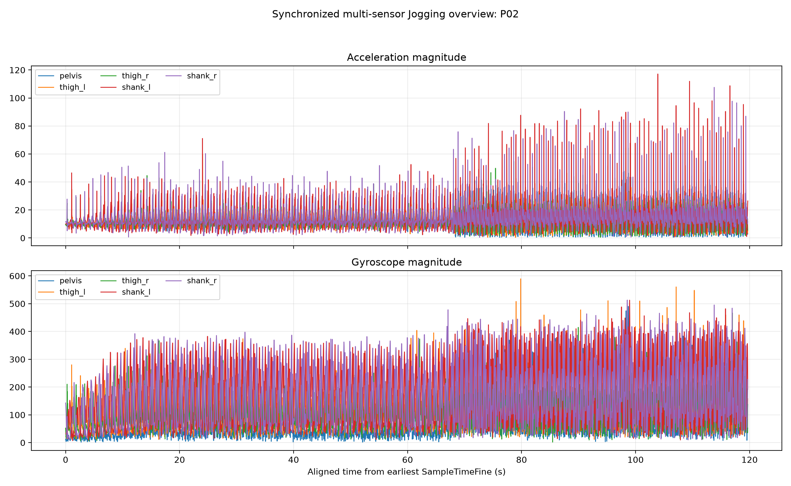

# hsi-semg-imu-feature-selection

Feature characterization and selection of fused sEMG and IMU signals for studying prior hamstring strain injury during dynamic movement.

This repository is the working thesis repository for sensor data, processing code, analysis outputs, and documentation. The current public-ready content centers on the curated Xsens DOT IMU pre-pilot workflow.

# Xsens IMU Pre-Pilot Thesis Walkthrough

## Thesis Context

This pre-pilot used Xsens DOT IMUs to check whether the IMU workflow is good enough to use before the actual pilot study. The goal was not to produce final clinical knee-angle results. The goal was to answer a simpler but important question:

**Can the collected IMU signals be validated, filtered, synchronized, and used to produce meaningful exploratory relative knee-flexion estimates?**

The activities were:

| Activity | Purpose in the pre-pilot |
|---|---|
| Standing | Check quiet baseline behavior and sensor stability. |
| Squat | Check slow, repeated bilateral lower-limb movement. |
| High Knee Hops | Check faster repeated movement with impacts. |
| Jogging | Check longer periodic dynamic movement. |

The anonymized participants were `P01`, `P02`, and `P03`.

The intended Xsens sensor setup was:

| Sensor | Segment |
|---|---|
| `pelvis` | Pelvis |
| `thigh_l` | Left thigh |
| `thigh_r` | Right thigh |
| `shank_l` | Left shank |
| `shank_r` | Right shank |

The curated dataset contains **41 usable CSV files from 55 uploaded source files**. Not every participant/activity has all five sensors. That is important because different analyses require different sensor availability.

**Main eligibility rule:** knee-flexion analysis requires a synchronized matching thigh + shank pair.

| Knee estimate | Required sensors |
|---|---|
| Left knee | `thigh_l` + `shank_l` |
| Right knee | `thigh_r` + `shank_r` |

Missing data is not the same as bad data. For example, `P03` still contributes useful raw signal and quality-control information where valid recordings exist, but `P03` is not usable for knee-flexion analysis because the required thigh-shank pairs are missing.

## Workflow At A Glance

```text
Raw Xsens CSVs
    ↓
Dataset Curation
    ↓
Packet / Time Validation
    ↓
Raw Signal Inspection
    ↓
Low-Pass Filtering
    ↓
Raw vs Filtered Comparison
    ↓
Quaternion Relative Orientation
    ↓
IMU-Derived Relative Knee Flexion
    ↓
Cycle Detection
    ↓
Bilateral Comparison
    ↓
Pre-Pilot Findings
```

Each stage has a specific job:

| Stage | One-sentence explanation |
|---|---|
| Raw Xsens CSVs | Original sensor exports from the uploaded `PrePilot_Test/` folder. |
| Dataset Curation | Clean copy into canonical activity/participant/sensor folders with anonymous IDs. |
| Packet / Time Validation | Check timing, packet continuity, sampling consistency, and synchronization before analysis. |
| Raw Signal Inspection | Plot accelerometer and gyroscope signals to see what the sensors actually recorded. |
| Low-Pass Filtering | Smooth high-frequency variation while preserving broad human movement trends. |
| Raw vs Filtered Comparison | Confirm filtering improves readability without hiding important raw behavior. |
| Quaternion Relative Orientation | Use orientation quaternions to compare thigh and shank motion in 3D. |
| IMU-Derived Relative Knee Flexion | Estimate relative thigh-shank flexion-like motion from quaternion-based relative rotation. |
| Cycle Detection | Detect repeated peaks to summarize squats, hops, and jogging periodicity. |
| Bilateral Comparison | Compare left and right leg timing and waveform similarity where both legs are available. |
| Pre-Pilot Findings | Decide what worked, what failed, and what the actual pilot protocol must improve. |

## Current Dataset

### What Was Used

The official curated dataset is:

```text
data/raw/xsens_imu/pre_pilot/
```

The original upload remains unchanged in:

```text
PrePilot_Test/
```

The previous official pre-pilot dataset is preserved but superseded:

```text
data/raw/xsens_imu/archive/pre_pilot_v1/
```

Current public documentation and figures refer to the curated dataset only. Previous numerical pre-pilot results are not used as current evidence.

### Why `PrePilot_Test/` Was Not Used Directly

Plain language: the source upload was useful, but it was not clean enough to analyze directly.

The upload contained:

- empty exports with zero data rows
- mislabeled source folders/files
- incomplete participant/activity combinations
- synchronization issues in some recordings
- participant names that should not appear in public dataset paths

The curated dataset fixes the public analysis structure without changing the raw numeric signal values. Empty or ambiguous source files are excluded through the manifest rather than silently deleted from the upload.

### Curated Dataset Structure

```text
data/raw/xsens_imu/pre_pilot/
  standing/
    P01/
      pelvis.csv
      thigh_l.csv
      thigh_r.csv
      shank_l.csv
      shank_r.csv
    P02/
    P03/
  squat/
    P01/
    P02/
    P03/
  high_knee_hops/
    P01/
    P02/
    P03/
  jogging/
    P01/
    P02/
```

Canonical sensor filenames are used where that sensor exists:

```text
pelvis.csv
thigh_l.csv
thigh_r.csv
shank_l.csv
shank_r.csv
```

### Participant Completeness

| Participant | Standing | Squat | High Knee Hops | Jogging |
| --- | --- | --- | --- | --- |
| P01 | 5/5 synchronized | 5/5 synchronized | 4/5 usable | 4/5 usable |
| P02 | 3/5 incomplete | 5/5 synchronized | 5/5 synchronized | 5/5 synchronized |
| P03 | 2/5 incomplete | 2/5 incomplete | 1/5 incomplete | not recorded |

**Conclusion:** `P01` and `P02` support the main dynamic knee-flexion checks. `P03` remains useful for raw signal/QC documentation, but required thigh-shank pairs are missing for knee-flexion estimates.

## Step 1: Raw Data Curation

### Plain-Language Goal

Make one clean, public-ready dataset from the uploaded source files without changing the sensor measurements.

### Technical Detail

The curation created anonymous participant IDs and canonical folder names. Sensor identity was determined from Xsens metadata and CSV contents rather than source folder names alone, because some uploaded folders were mislabeled.

### Data Used

- Source upload: `PrePilot_Test/`
- Curated output: `data/raw/xsens_imu/pre_pilot/`
- Curation manifest: `data/raw/xsens_imu/pre_pilot_manifest.csv`

### Output Produced

The main output is the 41-file curated dataset plus a manifest describing included, missing, empty, or ambiguous expected recordings.

### Figure For This Step

No figure is needed for curation. The useful artifact is the manifest:

```text
data/raw/xsens_imu/pre_pilot_manifest.csv
```

### Conclusion

The dataset is now organized enough to analyze reproducibly. The original upload remains untouched as the immutable source.

### Remaining Limitation

Curation cannot create missing trials or missing sensors. Incomplete participant/activity combinations remain incomplete.

## Step 2: Data Validation Before Preprocessing

### Plain-Language Goal

Check whether the recordings are structurally trustworthy before filtering or interpreting them.

> **Warning:** Filtering bad data does not make it good data.

### What Was Checked

Before preprocessing, the workflow checked:

- packet continuity
- duplicate packets
- missing packets
- abnormal `SampleTimeFine` gaps
- 60 Hz sampling consistency
- dead or constant channels
- quaternion norm behavior
- obvious spikes or clipping
- synchronization between sensors in the same participant/activity group

### Data Used

All curated CSV files in:

```text
data/raw/xsens_imu/pre_pilot/
```

### Implementation

Validation was performed during curation and signal-behavior analysis. The relevant scripts and outputs are:

```text
scripts/analyze_pre_pilot_signal_behavior.py
data/raw/xsens_imu/pre_pilot_manifest.csv
results/xsens_imu/pre_pilot/manifests/dataset_completeness.csv
```

### Output Produced

- curated manifest
- completeness matrix
- raw signal plots
- standing stability summary
- raw-vs-filtered plots

### Figure For This Step


This is a representative raw-signal quality figure. It shows unfiltered accelerometer and gyroscope behavior, so the reader can judge whether the sensor produced continuous, plausible signals before any smoothing was applied.

### What To Look For

- The signal should be continuous.
- Axes should respond when movement occurs.
- Quiet standing should look relatively stable.
- There should not be unexplained jumps, dropouts, or clipping plateaus.

**Main takeaway:** the usable curated files passed the basic "does this look like real sensor data?" check before moving into filtering or orientation analysis.

### Interpretation

The curated files were suitable for signal inspection and exploratory analysis. The main remaining issue is coverage rather than widespread signal corruption: some participant/activity/sensor combinations are missing.

### Remaining Limitation

The validation confirms recording integrity for usable files, but it does not provide anatomical calibration or external ground truth.

## Step 3: Raw Signal Quality Control

### Plain-Language Goal

Look directly at accelerometer and gyroscope signals before any processing. This answers: did each sensor behave like a sensor attached to a moving body segment?

### What Was Plotted

For every valid CSV, the analysis plotted:

- `Acc_X`, `Acc_Y`, `Acc_Z`
- `Gyr_X`, `Gyr_Y`, `Gyr_Z`
- acceleration magnitude
- gyroscope magnitude

The time axis uses the known 60 Hz sampling rate.

### Data Used

All valid curated CSVs from `P01`, `P02`, and `P03`.

### Implementation

```text
scripts/analyze_pre_pilot_signal_behavior.py
```

Raw plots are stored under:

```text
results/xsens_imu/pre_pilot/signal_behavior/raw/
```

### Output Produced

Per-participant, per-activity, per-sensor raw time-domain plots.

### Figure For This Step


### What The Figure Shows

This figure shows representative standing accelerometer and gyroscope signals before filtering. Standing is useful because the participant should not be making large intentional movements.

**What to look for:** continuous traces, small fluctuations during quiet standing, and no flat-lined or clipped channels.

**Main takeaway:** raw standing data are useful as a first sanity check, but raw plots alone cannot prove whether a fluctuation is sensor noise or actual participant movement.

### Conclusion

The raw signals show meaningful sensor behavior. Dynamic activities show clear movement patterns, and standing provides a useful baseline check.

### Remaining Limitation

Raw plots show what happened, but they do not automatically separate sensor noise from real participant movement. That judgment needs activity context.

## Step 4: Standing Stability Check

### Why Standing Matters

Standing should involve minimal physical movement. That makes it useful for checking whether the sensors can produce a relatively stable baseline.

Standing helps distinguish:

- baseline sensor variation
- random high-frequency noise
- slow drift
- spikes
- actual participant movement during a supposedly quiet trial

### Metrics Explained Simply

| Metric | Simple meaning |
|---|---|
| Mean | The average signal level during the recording. |
| Standard deviation | How much the signal fluctuates around its average. |
| RMS | A typical signal size that accounts for positive and negative values. |
| Peak-to-peak | The full spread from lowest value to highest value. |
| Drift | Whether the signal slowly trends upward or downward over time. |

### Data Used

Available standing sensors from `P01`, `P02`, and `P03`.

### Implementation

Standing behavior was summarized in:

```text
results/xsens_imu/pre_pilot/signal_behavior/standing_noise_summary.csv
results/xsens_imu/pre_pilot/signal_behavior/standing_status_criteria.md
```

The status labels are descriptive:

- `STABLE`
- `MINOR_VARIATION`
- `POSSIBLE_MOVEMENT`
- `SUSPICIOUS_SPIKES`

They are comparative within this dataset, not universal pass/fail thresholds.

### Figure For This Step



### What The Figure Shows

The figure compares raw and filtered standing behavior. Small fluctuations remain visible, while the filtered version makes the broader baseline trend easier to see.

**Before filtering:** small baseline fluctuations and early settling behavior are visible.

**After filtering:** the broader standing trend is easier to inspect without high-frequency variation dominating the view.

**Why the difference matters:** standing should be quiet, so this plot shows whether the baseline is stable enough to trust later movement analysis.

### Interpretation

- `P01` standing shows early settling/movement.
- `P02` and `P03` available standing sensors are more stable.
- Standing confirmed that the sensors can produce stable baseline behavior.

> **Main takeaway:** Standing confirmed that the sensors can produce stable baseline behavior, but the protocol should include a short "settle and stay still" period before recording.

### Remaining Limitation

Standing was not clean enough to use as a universal zero reference for all participants and activities, especially because `P01` showed early settling/movement.

## Step 5: Filtering

### Plain-Language Goal

The filter smooths high-frequency noise while keeping the main human movement pattern.

### Technical Detail

The preprocessing method was:

| Setting | Value |
|---|---|
| Sampling rate | 60 Hz |
| Filter type | 4th-order Butterworth low-pass |
| Cutoff frequency | 10 Hz |
| Phase handling | zero-phase `scipy.signal.sosfiltfilt` |

Zero-phase filtering matters because it prevents the filter from shifting the timing of peaks. That is important when comparing left and right legs or detecting repeated cycles.

### Why 10 Hz Was Used

The 10 Hz cutoff preserves broad movement cycles while reducing high-frequency variation. The previous spectral check showed:

- squat median `f95` was about 4.51 Hz
- jogging had more high-frequency content

So the filter is suitable for movement and kinematic trends. It is not meant to preserve every impact transient. Raw signals are still retained for impact/transient analysis.

### Data Used

All valid curated accelerometer and gyroscope channels.

### Implementation

```text
scripts/analyze_pre_pilot_signal_behavior.py
```

### Output Produced

Raw-vs-filtered comparison plots:

```text
results/xsens_imu/pre_pilot/signal_behavior/raw_vs_filtered/
```

### Remaining Limitation

Filtering improves interpretability, but it can smooth sharp impact events. Hops and jogging should still be inspected in raw form when impacts matter.

## Step 6: Raw Vs Filtered Comparison

This section is the visual bridge from raw sensor behavior to processed movement trends.

### Standing


**Before filtering:** small fluctuations and early settling are visible.

**After filtering:** the broader baseline trend is easier to see.

**Why the difference matters:** standing helps confirm baseline stability, but `P01` also shows why a quiet settling period should be built into the actual protocol.

**What to look for:** the filtered trace should smooth variation without changing the timing of visible trends.

**Main takeaway:** standing is a stability check, not a movement-performance result.

### Squat


**Before filtering:** movement cycles are visible but include higher-frequency variation.

**After filtering:** the repeated squat pattern is easier to interpret.

**Why the difference matters:** squat is the clearest activity for checking whether slow bilateral motion can be tracked, and filtering makes the repeated flexion/extension pattern easier to see.

**What to look for:** repeated peaks and valleys should remain after filtering, while small rapid fluctuations are reduced.

**Main takeaway:** filtering improves readability of the squat movement trend without replacing the raw signal.

### High Knee Hops


This representative signal shows that high-knee hops contain repeated movement cycles plus sharper transient behavior.

**What to look for:** repeated bursts of motion and sharper impact-like changes than in squat.

**Main takeaway:** high-knee hops are useful for checking whether the workflow handles faster, more impact-like movement.

Raw-vs-filtered example:



**Before filtering:** impacts and faster changes are visible.

**After filtering:** the repeated movement trend becomes easier to follow.

**Why the difference matters:** high-knee hops include impact-like events, so both raw and filtered views are needed.

**What to look for:** the filtered trace should show the broad hop rhythm, while the raw trace preserves sharper transient behavior.

**Main takeaway:** use filtered signals for movement-cycle readability, but keep raw signals for impact inspection.

### Jogging


This representative signal shows strong periodic jogging behavior over a longer recording window.

**What to look for:** repeating cycles that continue consistently through time.

**Main takeaway:** jogging produced clear periodic IMU behavior where synchronized thigh-shank pairs were available.

Raw-vs-filtered example:



**Before filtering:** jogging has more high-frequency content than squat.

**After filtering:** the periodic running-like movement trend is clearer.

**Why the difference matters:** filtered signals support cycle interpretation, while raw signals remain useful for inspecting impacts.

**What to look for:** periodic peaks should remain visible after filtering, while high-frequency content is reduced.

**Main takeaway:** jogging confirms the workflow can handle long, repetitive dynamic recordings, but the filtered plot should not be used to study every impact transient.

### Conclusion

Filtering made motion patterns easier to interpret without replacing raw inspection. The raw and filtered views answer different questions.

### Remaining Limitation

Filtered signals should not be treated as a perfect representation of impact behavior.

## Step 7: Cross-Sensor Behavior

### Plain-Language Goal

Check whether sensors on different body segments show related movement during the same activity.

### Data Used

Synchronized participant/activity recordings with multiple available sensors.

### Implementation

The signal-behavior script generated overview plots for magnitude signals across sensors.

### Figures For This Step

#### Squat Multi-Sensor Overview



This plot compares magnitude behavior across available sensors during synchronized squat recordings.

**What to look for:** sensors should show related timing because the body segments are moving during the same trial.

**Main takeaway:** the squat recording behaves like a coordinated multi-sensor movement trial rather than unrelated individual sensor traces.

#### Jogging Multi-Sensor Overview



This plot compares magnitude behavior across available sensors during synchronized jogging recordings.

**What to look for:** repeated periodic patterns across sensors, with larger dynamic behavior often visible in shank signals.

**Main takeaway:** synchronized jogging recordings show coherent periodic motion across body segments.

### What The Figures Show

The plots make it easier to see how motion appears across pelvis, thighs, and shanks. Shank signals often show larger dynamic behavior during jogging because the lower leg experiences fast cyclic motion.

### Conclusion

The synchronized multi-sensor plots support that the dynamic trials contain coordinated movement rather than isolated random sensor behavior.

### Remaining Limitation

Cross-sensor magnitude plots are not joint angles. They only show that movement is visible across body segments.

## Step 8: Quaternion Relative Orientation

### Plain-Language Goal

Use the orientation data from the IMUs to compare how the thigh and shank rotate relative to each other.

Quaternions describe sensor orientation in 3D without the wraparound problems of Euler angles. Quaternion values themselves are not knee angles.

### Technical Detail

For each valid thigh-shank pair:

1. Normalize `Quat_W`, `Quat_X`, `Quat_Y`, and `Quat_Z`.
2. Align thigh and shank samples using `SampleTimeFine`.
3. Compute relative thigh-to-shank orientation using quaternion-relative rotation.
4. Convert relative orientation to a rotation vector.

Relative orientation is more meaningful than simply subtracting two Euler angles, because Euler angles can wrap and depend on rotation order.

### Data Used

Only synchronized thigh-shank pairs:

- left knee: `thigh_l` + `shank_l`
- right knee: `thigh_r` + `shank_r`

### Implementation

```text
scripts/analyze_pre_pilot_knee_flexion.py
```

### Output Produced

Per-participant/activity/leg processed orientation CSVs:

```text
results/xsens_imu/pre_pilot/orientation/
```

### Figure For This Step

There is no current curated standalone segment-orientation presentation figure. The orientation step is represented in the generated knee-flexion estimates below, which are derived from the quaternion relative-orientation workflow.

**PPT takeaway:** show this as a method step, not as a result slide. The current presentation figures focus on the derived knee-flexion output because no standalone current orientation figure was generated.

### Conclusion

Quaternion processing provides a defensible way to estimate relative thigh-shank motion without naive Euler-angle subtraction.

### Remaining Limitation

The orientation is sensor-relative. Without anatomical sensor-to-segment calibration, it should not be interpreted as a clinical knee angle.

## Step 9: IMU-Derived Relative Knee Flexion

### Plain-Language Goal

Turn the relative thigh-shank orientation into one flexion-like curve that can be plotted over time.

Use this exact label:

```text
IMU-derived relative knee flexion estimate
```

### What It Is Not

It is:

- not a clinical knee angle
- not anatomically calibrated
- not validated against motion capture

### Technical Detail

The method:

1. Compute relative thigh-shank rotation.
2. Convert the relative rotation to rotation vectors.
3. Identify the dominant flexion-like axis for each pair/activity.
4. Project the relative rotation onto that axis.
5. Zero each activity to the lowest-motion 0.5 s window within the first 2 s.

Standing was not used as a universal zero reference because `P01` standing included early settling/movement, and each activity needed its own local baseline.

### Data Used

Valid synchronized thigh-shank pairs from:

- Squat
- High Knee Hops
- Jogging

### Output Produced

```text
results/xsens_imu/pre_pilot/orientation/pre_pilot_knee_angle_summary.csv
results/xsens_imu/pre_pilot/figures/knee_angle/
```

### Figure For This Step


### What The Figure Shows

`P02` squat shows closely matched left and right relative knee-flexion estimates. This is the strongest proof-of-method case in the pre-pilot.

**X-axis:** time during the squat recording, in seconds.

**Y-axis:** IMU-derived relative knee flexion estimate, in degrees. This is not a clinical anatomical knee angle.

**Peaks:** repeated high points in the flexion-like curve, interpreted here as repeated squat cycles.

**Example quality:** good example. The left and right traces have similar shape, range, cycle count, and timing.

**Main takeaway:** `P02` squat is the clearest evidence that the quaternion-based thigh-shank workflow can produce a coherent relative knee-flexion estimate.

**PPT takeaway:** use this as the main success-case slide for the IMU method.

### Conclusion

Relative knee-flexion estimation is feasible when synchronized thigh-shank pairs are available.

### Remaining Limitation

The flexion-like axis is data-derived. This supports feasibility, not anatomical accuracy.

## Step 10: Cycle Detection

### Plain-Language Goal

Find repeated peaks in the knee-flexion estimate so the movement can be summarized by cycle count and timing.

### What A Detected Peak Represents

A detected peak is a local maximum in the IMU-derived relative knee-flexion estimate. In squat, a peak roughly corresponds to a repeated flexion phase. In jogging and hopping, peaks summarize periodic movement but should not be called validated gait events.

### Why Cycle Count Matters

Cycle count helps check whether the signal matches the expected repeated activity. It also helps identify inconsistent trials.

More detected peaks does not automatically mean better data. For example, `P01` squat has more detected peaks than expected, but the bilateral behavior is unstable.

### Figures For This Step

#### P01 Squat: Problematic Cycle Example


**X-axis:** time during the squat recording, in seconds.

**Y-axis:** IMU-derived relative knee flexion estimate, in degrees.

**Peaks:** detected local maxima in the flexion-like curve. They are counted as repeated cycles for this exploratory analysis.

**Example quality:** problematic example. The left and right traces do not behave like a clean synchronized bilateral squat, and the detected peak counts differ.

**Main takeaway:** more detected peaks do not automatically mean better data; `P01` squat should be investigated rather than used as proof of reliable bilateral tracking.

#### P02 Squat: Clean Cycle Example


**X-axis:** time during the squat recording, in seconds.

**Y-axis:** IMU-derived relative knee flexion estimate, in degrees.

**Peaks:** repeated high points in the flexion-like curve, corresponding to the detected squat cycles.

**Example quality:** good example. Both legs show 5 detected cycles with closely matched timing.

**Main takeaway:** `P02` squat demonstrates the strongest cycle-detection behavior in the pre-pilot.

### Squat Cycle Findings

| Participant | Left cycles | Right cycles | Interpretation |
|---|---:|---:|---|
| P01 | 10 | 9 | Unstable/inconsistent; investigate. |
| P02 | 5 | 5 | Strong bilateral consistency. |
| P03 | N/A | N/A | Required thigh-shank pairs missing. |

### Conclusion

Cycle detection works best when the underlying waveform is coherent. `P02` squat is the clearest example.

### Remaining Limitation

Cycle detection is exploratory. It does not replace a validated gait-event or repetition-labeling method.

## Step 11: Bilateral Comparison

### Plain-Language Goal

Compare left and right legs when both are available.

### Terms Explained Simply

| Term | Meaning |
|---|---|
| ROM | Range of motion: the spread from the minimum to maximum estimated flexion value in the recording. |
| Cycle count | The number of detected repeated peaks in the flexion-like curve. |
| Correlation | Similarity of waveform shape. |
| Lag | Timing offset between left and right signals. |

### Activity-Specific Meaning

Squat should be largely bilateral and synchronous, so a strong positive correlation with near-zero lag is expected.

Jogging and high-knee movement can be alternating, so the legs may naturally move out of phase. In those activities, a negative bilateral correlation is not automatically bad.

### Squat Results

| Participant | Left ROM | Right ROM | Left cycles | Right cycles | Bilateral correlation | Lag | Interpretation |
|---|---:|---:|---:|---:|---:|---:|---|
| P01 | ~118.1 deg | ~124.2 deg | 10 | 9 | -0.242 | -21 samples | Unstable / investigate |
| P02 | ~80.6 deg | ~82.0 deg | 5 | 5 | 0.998 | 0 samples | Strong bilateral consistency |
| P03 | N/A | N/A | N/A | N/A | N/A | N/A | Required sensor pairs missing |

### Interpretation

`P02` squat is the strongest proof-of-method case because:

- left ROM is about 80.6 deg
- right ROM is about 82.0 deg
- both legs have 5 detected cycles
- bilateral correlation is 0.998
- lag is 0 samples

`P01` squat is unstable because:

- left ROM is about 118.1 deg
- right ROM is about 124.2 deg
- detected peaks are 10 vs 9
- bilateral correlation is -0.242
- lag is -21 samples

So `P01` squat should not be used as evidence of reliable bilateral squat tracking.

### Figure For This Step


This summary figure compares squat ROM and detected cycle counts across computable participants.

**What to look for:** `P02` has similar left/right ROM and equal cycle count, while `P01` has larger ROM and mismatched cycle counts.

**Main takeaway:** `P02` is the clearest squat proof-of-method case; `P01` is a useful warning example; `P03` is not computable for knee-flexion.

### Remaining Limitation

Correlation and lag summarize waveform similarity, but they do not prove anatomical correctness.

## Step 12: Activity Findings

### Squat

Squat shows the clearest proof-of-method result in `P02`.


**X-axis:** time during the squat recording, in seconds.

**Y-axis:** IMU-derived relative knee flexion estimate, in degrees.

**Peaks:** repeated flexion-like maxima used for cycle counting.

**Example quality:** good example. `P02` has strong left-right agreement and is the preferred squat slide.

**Conclusion:** `P02` squat supports the processing method because both legs show similar ROM, cycle count, timing, and waveform shape.

**Main takeaway:** use `P02` squat as the main proof-of-method result.

**Limitation:** `P01` squat is unstable and should be investigated before using similar data as evidence.

### High Knee Hops


**X-axis:** time during the high-knee hops recording, in seconds.

**Y-axis:** IMU-derived relative knee flexion estimate, in degrees.

**Peaks:** repeated flexion-like maxima. These summarize repeated hop cycles, not isolated impact spikes alone.

**Example quality:** useful dynamic example. It demonstrates faster repeated movement than squat.

Findings:

- `P01`: about 5 cycles, `r = 0.995`, lag 0 samples.
- `P02`: about 6 cycles each.
- `P02`: ROM about 120.0 deg left and 112.7 deg right.
- `P02`: negative bilateral correlation with about 26-sample lag, consistent with alternating-leg behavior.
- `P03`: not computable because required thigh-shank pairs are missing.

**Conclusion:** high-knee hops show repeated motion/impact cycles. Negative bilateral correlation can be expected when the legs alternate.

**Main takeaway:** high-knee hops show the method can handle faster repeated movement, but interpretation remains exploratory.

**Limitation:** impact spikes alone were not treated as knee-flexion peaks, but the analysis remains exploratory.

### Jogging


**X-axis:** time during the jogging recording, in seconds.

**Y-axis:** IMU-derived relative knee flexion estimate, in degrees.

**Peaks:** repeated flexion-like maxima used to summarize periodic jogging behavior. They are not validated gait events.

**Example quality:** good periodic dynamic example. `P02` has computable left and right jogging estimates.

Findings:

- `P01`: right only, about 90.3 deg range, 128 peaks, mean interval about 0.943 s.
- `P02`: left/right about 86.0 deg / 85.0 deg.
- `P02`: 129 / 128 peaks.
- `P02`: mean intervals about 0.929 / 0.927 s.
- `P02`: bilateral correlation `r = -0.785`, lag 27 samples.
- `P03`: jogging not recorded.

**Conclusion:** `P02` jogging is coherent and periodic. The negative bilateral correlation is consistent with alternating gait-like movement.

**Main takeaway:** jogging supports feasibility for longer periodic activity, while out-of-phase left/right behavior is expected in alternating movement.

**PPT takeaway:** negative correlation in jogging is not automatically a failure; it can reflect the legs alternating.

**Limitation:** detected cycles are exploratory periodic peaks, not validated gait cycles.

## Presentation Summary Table

| Activity | Participant | Left | Right | Cycles | Correlation | Lag | Interpretation |
|---|---|---|---|---|---:|---:|---|
| Squat | P01 | ROM ~118.1 deg | ROM ~124.2 deg | 10 L / 9 R | -0.242 | -21 samples | Unstable / investigate |
| Squat | P02 | ROM ~80.6 deg | ROM ~82.0 deg | 5 L / 5 R | 0.998 | 0 samples | Strong proof-of-method case |
| Squat | P03 | N/A | N/A | N/A | N/A | N/A | Required sensor pairs missing |
| High Knee Hops | P01 | Computable | Computable | ~5 each | 0.995 | 0 samples | Strong bilateral timing |
| High Knee Hops | P02 | ROM ~120.0 deg | ROM ~112.7 deg | ~6 each | -0.186 | 26 samples | Alternating-leg behavior |
| High Knee Hops | P03 | N/A | N/A | N/A | N/A | N/A | Required sensor pairs missing |
| Jogging | P01 | N/A | ROM ~90.3 deg | 128 R | N/A | N/A | Right side only |
| Jogging | P02 | ROM ~86.0 deg | ROM ~85.0 deg | 129 L / 128 R | -0.785 | 27 samples | Coherent alternating periodicity |
| Jogging | P03 | N/A | N/A | N/A | N/A | N/A | Not recorded |

## What Worked

- Recordings that were complete could be synchronized.
- Included files used consistent 60 Hz sampling.
- Packet continuity was stable for included files.
- Squat, high-knee hops, and jogging showed clear movement patterns.
- `P02` squat showed strong bilateral agreement.
- `P02` jogging showed coherent periodicity.
- Raw and filtered plots together gave useful quality-control evidence.
- Quaternion-based relative orientation was feasible for valid thigh-shank pairs.

## What Still Limits The Pre-Pilot

- `P03` has incomplete sensor coverage.
- `P01` jogging is missing the left shank required for left-knee estimation.
- `P01` squat is unstable and should not be used as reliable bilateral evidence.
- `P01` standing shows early settling/movement.
- There was no anatomical sensor-to-segment calibration.
- There was no external motion-capture ground truth.
- The flexion axis is data-derived.

> **Important limitation:** These results support feasibility of the IMU processing workflow. They do not prove anatomical knee-angle accuracy.

## Protocol Recommendations For The Actual Pilot

Use the pre-pilot findings to make the next data collection more consistent:

- Confirm all sensors are connected before recording.
- Confirm all five expected IMUs are recording for each complete trial.
- Use a fixed quiet baseline period before movement.
- Give a clear countdown before the participant starts.
- Ensure synchronized recording start across sensors.
- Verify sensor placement before each trial.
- Define exact activity duration and repetition count.
- Check data immediately after each trial.
- Repeat failed, empty, incomplete, or visibly desynchronized trials immediately.
- Keep raw signals for impact/transient analysis even when filtered signals are used for movement trends.
- Add anatomical calibration and external validation if anatomical knee angles are required later.

## Recommended Figures For Presentation

Use this order if building a short thesis presentation from the README.

| Slide | Figure or artifact | Slide topic | Key message |
|---:|---|---|---|
| 1 | Dataset table in README | Sensor setup / dataset | 3 participants, 4 activities, 5 intended sensor locations, 41 usable curated CSVs. |
| 2 | `results/xsens_imu/pre_pilot/figures/signal_behavior/01_representative_standing_raw_acc_gyr.png` | Raw signal quality | Start by showing the unfiltered IMU signal before any processing. |
| 3 | `results/xsens_imu/pre_pilot/figures/signal_behavior/03_squat_raw_vs_filtered.png` | Filtering before vs after | Filtering smooths high-frequency variation while preserving the squat movement trend. |
| 4 | `results/xsens_imu/pre_pilot/figures/signal_behavior/02_standing_raw_vs_filtered.png` | Standing stability | Standing is mostly stable, but `P01` shows why a settle-and-stay-still period is needed. |
| 5 | `results/xsens_imu/pre_pilot/figures/signal_behavior/06_squat_multisensor_overview.png` | Dynamic signal behavior | Synchronized sensors show coordinated squat motion across body segments. |
| 6 | No standalone current figure | Quaternion/orientation concept | Orientation is an intermediate computational step; current figures focus on the derived knee-flexion output. |
| 7 | `results/xsens_imu/pre_pilot/figures/knee_angle/02_P02_squat_left_right_overlay.png` | Knee-flexion derivation | The quaternion-relative workflow produces a clear IMU-derived relative knee flexion estimate for `P02`. |
| 8 | `results/xsens_imu/pre_pilot/figures/knee_angle/02_P02_squat_left_right_overlay.png` | P02 squat success case | `P02` has 5 cycles per leg, high bilateral agreement, and zero lag. |
| 9 | `results/xsens_imu/pre_pilot/figures/knee_angle/01_P01_squat_left_right_overlay.png` | P01 squat problematic case | `P01` squat is unstable, so it should not be used as proof of reliable bilateral tracking. |
| 10 | `results/xsens_imu/pre_pilot/figures/knee_angle/03_representative_high_knee_hops.png` and `results/xsens_imu/pre_pilot/figures/knee_angle/04_representative_P02_jogging.png` | High-knee / jogging findings | Faster and longer dynamic activities show repeated, periodic behavior. |
| 11 | Limitations section in README | Limitations | Missing sensors, no anatomical calibration, and no external ground truth limit interpretation. |
| 12 | Protocol recommendations section in README | Actual-pilot recommendations | Improve sensor completeness, quiet baseline, synchronized start, and immediate trial checks. |

## Repository Map For This Pre-Pilot

```text
data/
  raw/
    xsens_imu/
      pre_pilot/
      pre_pilot_manifest.csv
      archive/
        pre_pilot_v1/

docs/
  pre_pilot/
    final_pre_pilot_summary.md

results/
  xsens_imu/
    pre_pilot/
      manifests/
      signal_behavior/
      orientation/
      figures/
        signal_behavior/
        knee_angle/

scripts/
  analyze_pre_pilot_signal_behavior.py
  analyze_pre_pilot_knee_flexion.py
```

## Reproducibility

Main Python dependencies:

- `pandas`
- `numpy`
- `matplotlib`
- `scipy`

Current analysis scripts:

```powershell
python scripts/analyze_pre_pilot_signal_behavior.py
python scripts/analyze_pre_pilot_knee_flexion.py
```

Raw files in `data/raw/` should not be overwritten. Derived data, plots, and summaries should be written under `results/` or `data/processed/` as appropriate.

## Final Takeaway

The pre-pilot successfully validated the signal-processing workflow. Dynamic activity signals are clear and periodic, filtering improves interpretability, and relative knee-flexion estimation is feasible when synchronized thigh-shank pairs are available.

`P02` provides the strongest proof-of-method evidence, especially for squat and jogging. `P01` shows useful dynamic recordings but also highlights protocol issues, especially standing settling and squat instability. `P03` remains useful for raw signal/QC documentation but not knee-flexion analysis.

**Overall conclusion:** the results support feasibility of the IMU processing workflow, not anatomical accuracy. Protocol consistency must improve before the actual pilot.
