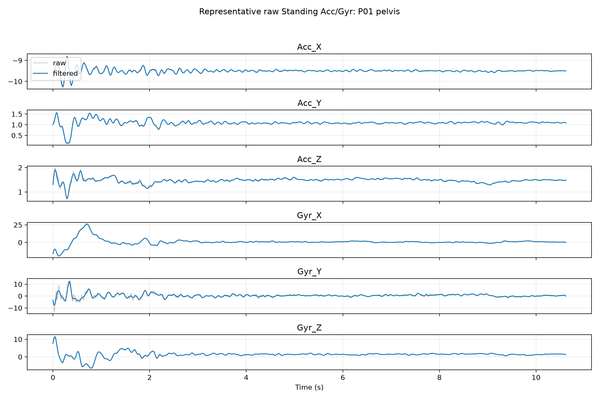
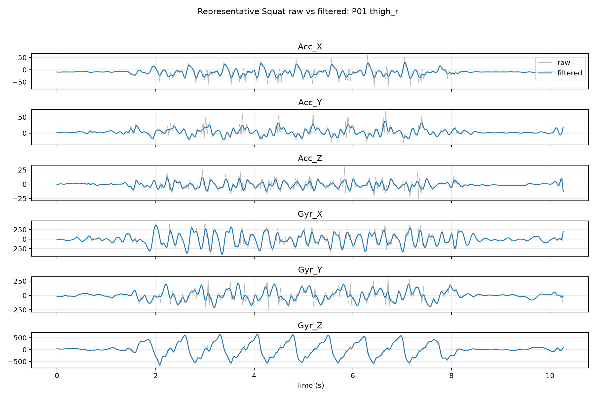
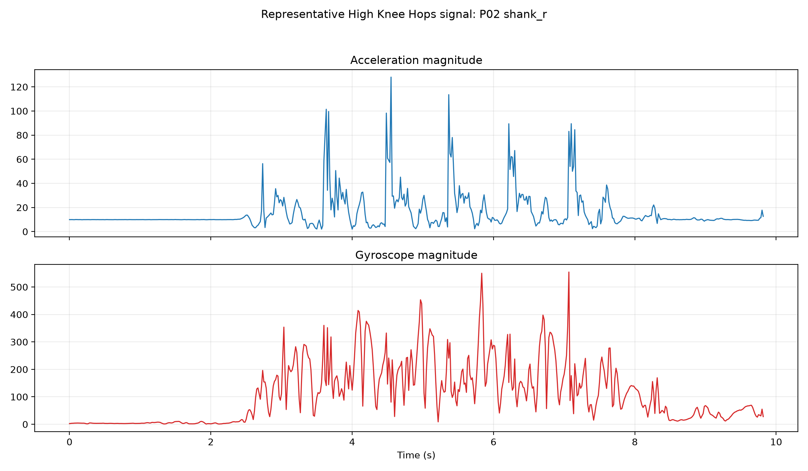
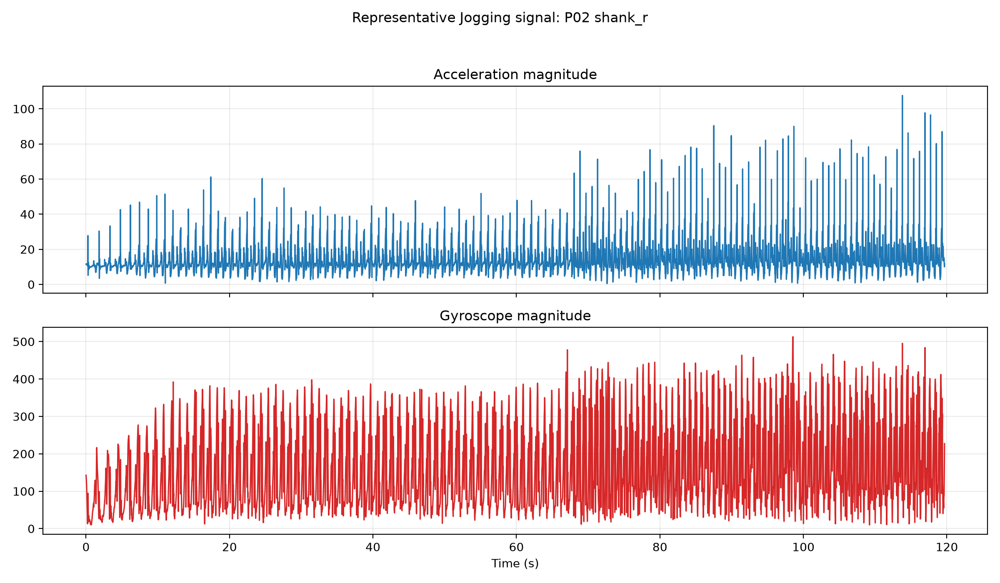
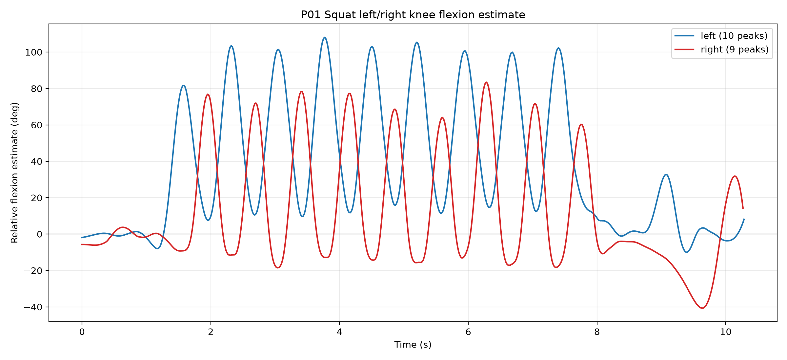
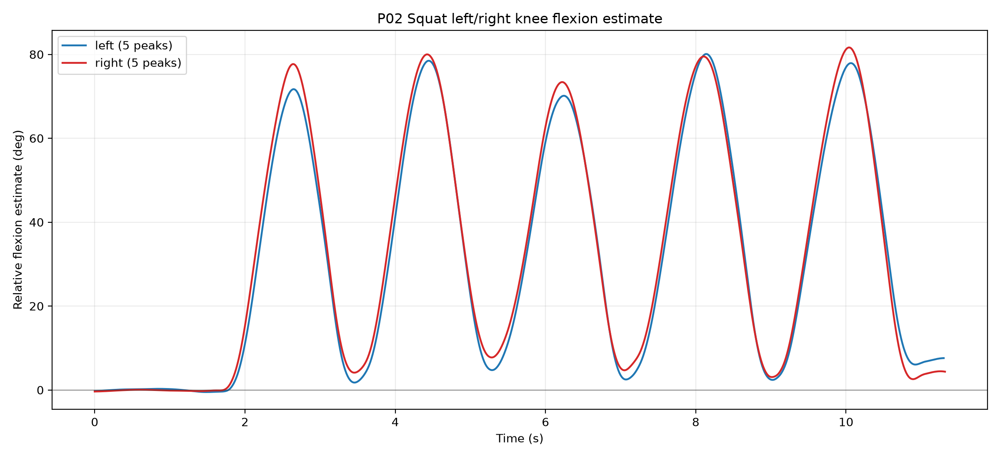
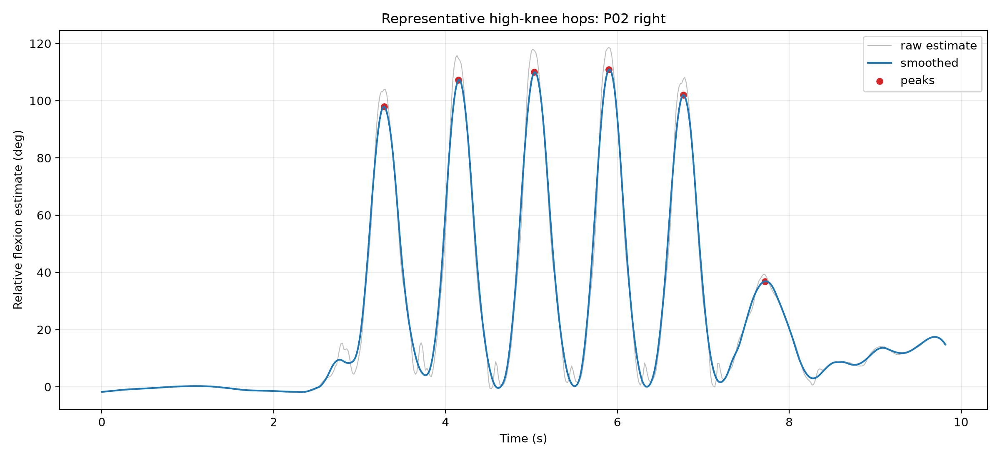
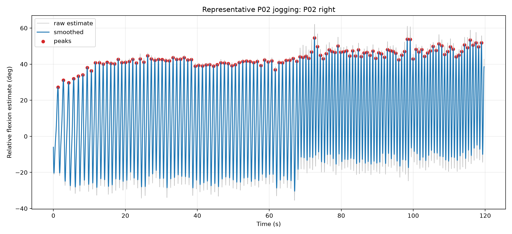
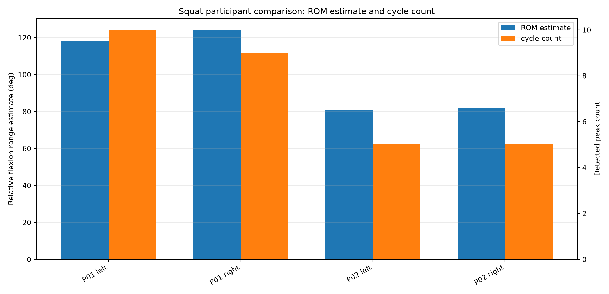

# hsi-semg-imu-feature-selection

Feature characterization and selection of fused sEMG and IMU signals for studying prior hamstring strain injury during dynamic movement.

This repository is the working thesis repository for sensor data, processing code, analysis outputs, and documentation. The current public-ready content centers on the curated Xsens DOT IMU pre-pilot workflow. Future sEMG data, additional IMU/sensor data, and later thesis analyses will be added as the project develops.

# Xsens DOT IMU Pre-Pilot Analysis

## Purpose

The current pre-pilot analysis validates the IMU data-processing workflow before the actual pilot. It checks raw signal quality, filtering behavior, synchronization, quaternion-based relative orientation, and exploratory knee-flexion estimation from synchronized thigh-shank sensor pairs.

Previous pre-pilot numerical results from the older 12-file dataset are superseded. The old raw dataset is preserved under `data/raw/xsens_imu/archive/pre_pilot_v1/`; current documentation and figures refer to the curated dataset only.

## Dataset

The official curated Xsens IMU pre-pilot dataset is stored in:

```text
data/raw/xsens_imu/pre_pilot/
```

Dataset summary:

- 3 anonymized participants: `P01`, `P02`, `P03`
- 41 curated usable CSVs
- Activities: Standing, Squat, High Knee Hops, Jogging
- Sensors where available: `pelvis`, `thigh_l`, `thigh_r`, `shank_l`, `shank_r`
- Sampling rate: 60 Hz
- Original immutable source upload: `PrePilot_Test/`
- Curation manifest: `data/raw/xsens_imu/pre_pilot_manifest.csv`

The curated dataset uses canonical activity/participant/sensor paths, for example:

```text
data/raw/xsens_imu/pre_pilot/squat/P02/thigh_l.csv
```

The raw CSV schema contains:

| Column group | Columns |
|---|---|
| Packet/timing | `PacketCounter`, `SampleTimeFine` |
| Accelerometer | `Acc_X`, `Acc_Y`, `Acc_Z` |
| Gyroscope | `Gyr_X`, `Gyr_Y`, `Gyr_Z` |
| Quaternion | `Quat_W`, `Quat_X`, `Quat_Y`, `Quat_Z` |

The files do not explicitly document physical units, so interpretation avoids unsupported unit claims.

## Signal Preprocessing

Signal behavior analysis was performed with Python and Matplotlib in `scripts/analyze_pre_pilot_signal_behavior.py`.

The workflow includes:

- Raw QC plots for accelerometer and gyroscope axes, acceleration magnitude, and gyroscope magnitude.
- 4th-order Butterworth low-pass filtering.
- 10 Hz cutoff.
- 60 Hz sampling rate.
- Zero-phase filtering using `scipy.signal.sosfiltfilt`.

The 10 Hz cutoff was used to preserve the main movement envelopes for squat, high-knee hops, and jogging while reducing high-frequency noise in the signals used for visual comparison and exploratory cycle detection. Raw signals are retained and plotted because impact transients and sharp events, especially in hopping and jogging, may be meaningful and should not be judged only from filtered data.

Signal behavior outputs:

```text
results/xsens_imu/pre_pilot/signal_behavior/
results/xsens_imu/pre_pilot/figures/signal_behavior/
```

## Signal Behavior Findings

Main observations:

- P01 standing shows early settling/movement, especially in pelvis and thigh signals.
- P02 and P03 available standing sensors are more stable.
- Squat shows clear repetitive motion, especially in P02.
- High Knee Hops show repeated impact/motion cycles.
- Jogging shows strong periodicity over the full recording where synchronized pairs exist.
- No obvious clipping or saturation was detected in the generated signal-behavior summaries.

Standing noise/stability summary:

```text
results/xsens_imu/pre_pilot/signal_behavior/standing_noise_summary.csv
```

## Knee-Flexion Method

Knee-flexion analysis was performed in `scripts/analyze_pre_pilot_knee_flexion.py`.

The method uses valid synchronized thigh-shank pairs only:

- Left knee: `thigh_l` + `shank_l`
- Right knee: `thigh_r` + `shank_r`

The computation:

1. Normalize `Quat_W/X/Y/Z`.
2. Align thigh and shank samples using `SampleTimeFine`.
3. Compute relative thigh-to-shank orientation with quaternion operations.
4. Convert the relative orientation to rotation vectors.
5. Determine a dominant flexion-like axis from the activity-local relative rotation vectors.
6. Project the relative rotation vector onto that axis.
7. Zero each activity/leg using the lowest-motion 0.5 s paired window within the first 2 s, based on combined thigh+shank gyroscope magnitude.

The output is labeled:

```text
IMU-derived relative knee flexion estimate
```

It is not an anatomical or clinically validated knee angle. No anatomical sensor-to-segment calibration or external motion-capture ground truth was used.

Knee-flexion outputs:

```text
results/xsens_imu/pre_pilot/orientation/
results/xsens_imu/pre_pilot/orientation/pre_pilot_knee_angle_summary.csv
results/xsens_imu/pre_pilot/figures/knee_angle/
```

## Main Results

### Squat

| Participant | Left ROM | Right ROM | Left cycles | Right cycles | Bilateral correlation | Lag | Interpretation |
|---|---:|---:|---:|---:|---:|---:|---|
| P01 | ~118.1 deg | ~124.2 deg | 10 | 9 | -0.242 | -21 samples | Unstable / investigate |
| P02 | ~80.6 deg | ~82.0 deg | 5 | 5 | 0.998 | 0 samples | Strong bilateral consistency |
| P03 | N/A | N/A | N/A | N/A | N/A | N/A | Required sensor pairs missing |

### High Knee Hops

- P01: ~5 cycles, bilateral correlation `r = 0.995`, lag `0` samples.
- P02: ~6 cycles each, ROM ~120.0 deg left / ~112.7 deg right. Negative bilateral correlation with ~26-sample lag is consistent with alternating-leg behavior.
- P03: not computable because required thigh-shank pairs are missing.

### Jogging

- P01 right only: ~90.3 deg range, 128 peaks, mean interval ~0.943 s.
- P02 left/right: ~86.0 deg / ~85.0 deg, 129/128 peaks, mean intervals ~0.929 / ~0.927 s.
- P02 bilateral correlation: `r = -0.785` with 27-sample lag, consistent with alternating legs.
- P03: not recorded / not computable for thigh-shank knee-flexion analysis.

## Interpretation

- P02 squat is the strongest proof-of-method case: both legs show highly similar range, cycle count, timing, and waveform shape.
- P02 jogging is coherent and periodic across both legs.
- Alternating activities can produce negative bilateral correlation because the legs move out of phase.
- P01 squat should not be used as evidence of reliable bilateral squat tracking; it is unstable and needs investigation.
- P03 remains useful for raw signal/QC documentation, but not for knee-angle analysis because required synchronized thigh-shank pairs are missing.

## Limitations

- Incomplete sensor coverage in P03.
- P01 jogging is missing the synchronized left shank required for left-knee estimation.
- P01 squat shows unstable bilateral behavior.
- No anatomical sensor-to-segment calibration was performed.
- No external motion-capture ground truth was available.
- The flexion axis is data-derived.
- The derived quantity is an IMU-based relative estimate, not a validated anatomical knee angle.

## Final Figures

### Signal Behavior

Representative standing raw/filtered behavior:



Representative squat raw vs filtered behavior:



Representative High Knee Hops signal:



Representative Jogging signal:



### Knee-Flexion Estimates

P01 squat left/right overlay:



P02 squat left/right overlay:



Representative high-knee hops knee-flexion estimate:



Representative P02 jogging knee-flexion estimate:



Squat ROM/cycle comparison:



## Repository Structure

```text
data/
  raw/
    xsens_imu/
      pre_pilot/
      pre_pilot_manifest.csv
      archive/pre_pilot_v1/

docs/
  pre_pilot/
    final_pre_pilot_summary.md

results/
  xsens_imu/
    pre_pilot/
      signal_behavior/
      orientation/
      figures/

scripts/
  analyze_pre_pilot_signal_behavior.py
  analyze_pre_pilot_knee_flexion.py
```

## Reproducibility

Main Python dependencies:

- `pandas`
- `numpy`
- `matplotlib`
- `scipy`

Current pre-pilot analysis scripts:

```powershell
python scripts/analyze_pre_pilot_signal_behavior.py
python scripts/analyze_pre_pilot_knee_flexion.py
```

Raw files in `data/raw/` should not be overwritten. Derived data, plots, and summaries should be written under `results/` or `data/processed/` as appropriate.
