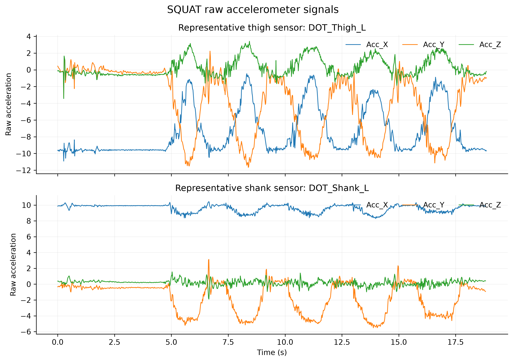
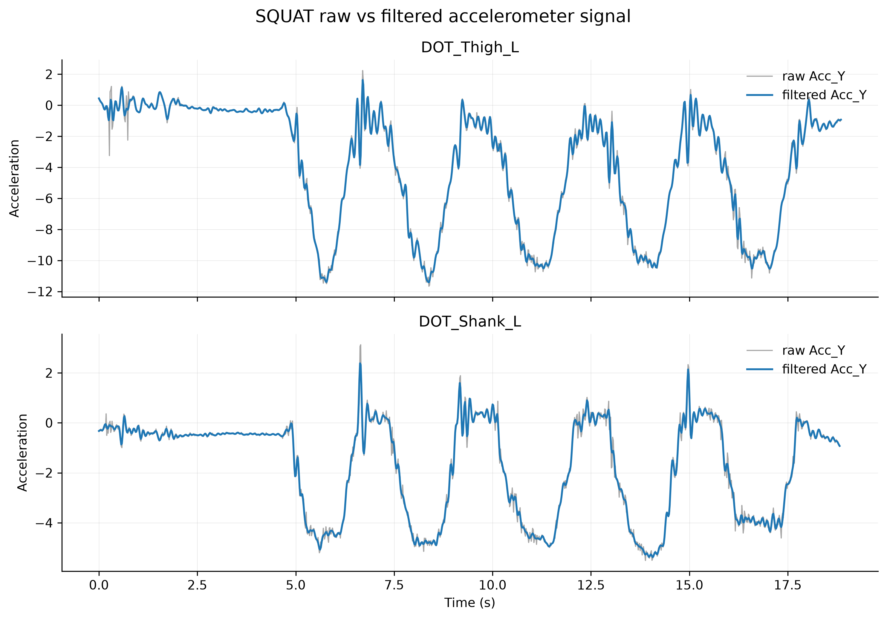
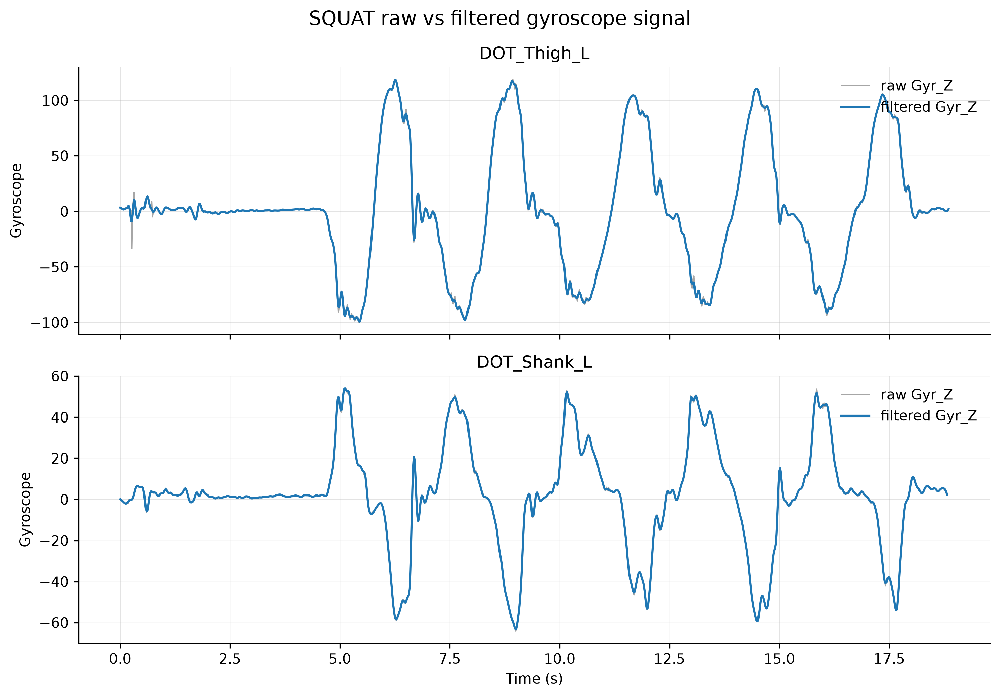
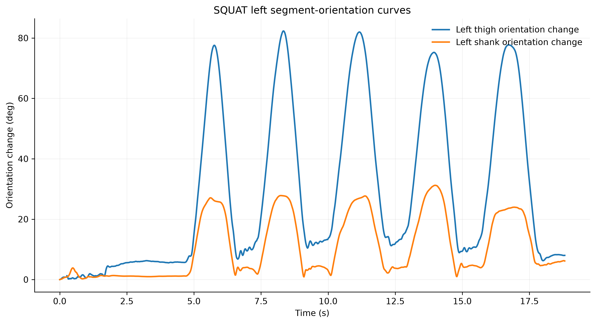
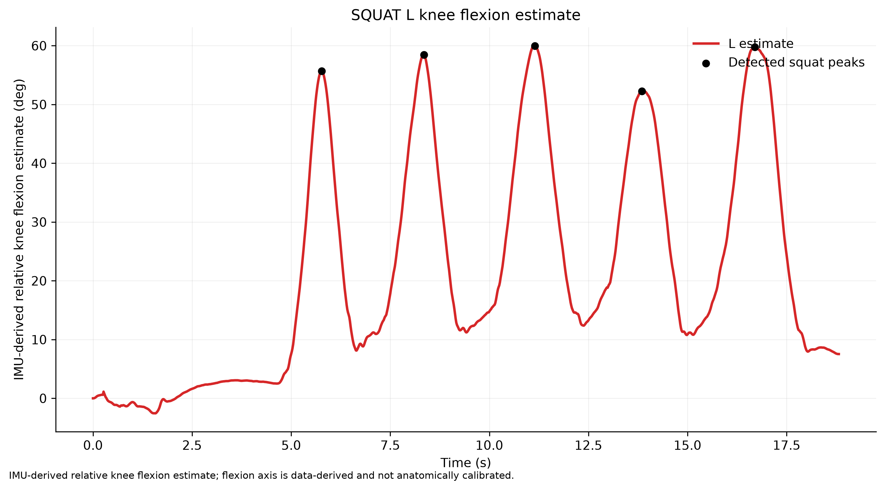
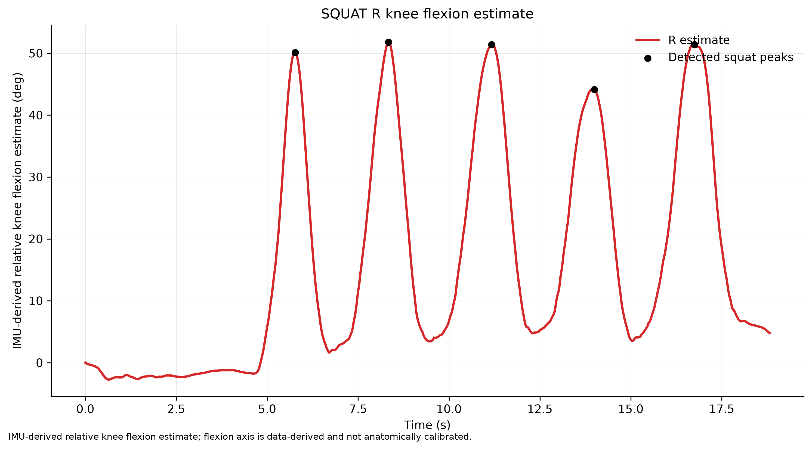
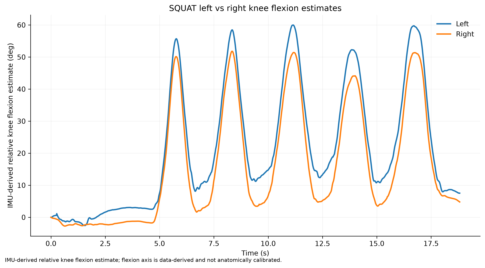

# hsi-semG-imu-feature-study

Feature characterization and selection of fused sEMG and IMU signals for studying prior hamstring strain injury during dynamic movement.

This repository is intended to become the main thesis repository for sensor data, processing code, analysis outputs, and documentation. The current committed content mainly covers an Xsens DOT IMU pre-pilot workflow. sEMG data, additional IMU/sensor data, and later thesis analyses will be added as the project develops.

# Xsens DOT IMU Pre-Pilot Analysis

## 1. Purpose

The current pre-pilot analysis uses Xsens DOT IMU recordings to validate the IMU data-processing workflow, inspect raw signal quality, test filtering and visualization steps, and check whether the recorded signals are suitable for later thesis analysis.

Available sensors in the current dataset:

- `DOT_Thigh_L`
- `DOT_Thigh_R`
- `DOT_Shank_L`
- `DOT_Shank_R`

The expected pelvis sensor, `DOT_Pelvis`, is not present in the current dataset.

## 2. Dataset

The raw Xsens pre-pilot dataset is stored in `data/raw/xsens_imu/pre_pilot/` and contains 12 Xsens DOT CSV exports:

- Activities: `STANDING`, `SQUAT`, `JOGGING`
- Output rate: `60Hz`
- Metadata found in the files includes `SyncStatus: Synced`, `FilterProfile: Dynamic`, `Measurement Mode: Custom modes - custom mode5`, and per-file `StartTime`

Main CSV columns:

| Column group | Columns |
|---|---|
| Packet/timing | `PacketCounter`, `SampleTimeFine` |
| Accelerometer | `Acc_X`, `Acc_Y`, `Acc_Z` |
| Gyroscope | `Gyr_X`, `Gyr_Y`, `Gyr_Z` |
| Quaternion | `Quat_W`, `Quat_X`, `Quat_Y`, `Quat_Z` |

The CSVs do not explicitly document physical units for the acceleration, gyroscope, quaternion, or `SampleTimeFine` columns. The analysis therefore avoids making unsupported unit claims.

## 3. Processing Pipeline

### Raw file inspection and manifest creation

Script: `src/xsens_imu/build_manifest.py`

What was done:

- Recursively loaded all CSVs in `data/raw/xsens_imu/pre_pilot/`
- Parsed Xsens metadata separately from numeric data
- Handled the trailing empty CSV field found in the raw exports
- Normalized metadata whitespace such as `DeviceTag:, DOT_Thigh_R`
- Extracted filenames, device tags, activities, start times, output rates, row counts, packet ranges, and `SampleTimeFine` ranges

Why it was needed:

- To create a machine-readable inventory of the raw dataset
- To identify missing sensors and continuity issues before analysis

Outputs:

- `results/xsens_imu/pre_pilot/manifests/xsens_manifest.csv`

### Packet continuity and timestamp checks

Script: `src/xsens_imu/build_manifest.py`

What was done:

- Checked `PacketCounter` continuity
- Checked `SampleTimeFine` spacing against the observed 60 Hz recording pattern
- Reported missing packets, duplicate packets, and abnormal gaps
- Compared activity-level synchronization across files

Key result:

- `SHANK_L_STANDING.csv` has 4 missing packets and 2 abnormal `SampleTimeFine` gaps.
- `SQUAT` and `STANDING` files are synchronized across the available thigh/shank sensors.
- `JOGGING` left-side and right-side recordings are not fully synchronized as one bilateral trial.

### Raw signal quality control

Script: `src/xsens_imu/raw_signal_qc.py`

What was done:

- Plotted raw accelerometer, gyroscope, quaternion, acceleration magnitude, and gyroscope magnitude per recording
- Computed signal statistics, quaternion norm checks, non-finite value checks, dead-channel checks, and jump metrics

Why it was needed:

- To verify that the raw signals were readable and broadly usable before filtering or derived analysis

Outputs:

- `results/xsens_imu/pre_pilot/qc/raw_qc_summary.csv`
- `results/xsens_imu/pre_pilot/qc/raw_qc/`

### Standing baseline assessment

Scripts:

- `src/xsens_imu/standing_baseline_analysis.py`
- `src/xsens_imu/standing_jump_analysis.py`

What was done:

- Analyzed only `STANDING` recordings
- Quantified accelerometer stability, gyroscope bias/RMS/drift, and quaternion/orientation stability
- Computed relative orientation with respect to the first valid sample
- Investigated a common orientation jump around 3.45 s

Why it was needed:

- To determine whether the standing recordings could be used as static baseline references

Outputs:

- `results/xsens_imu/pre_pilot/qc/standing_baseline_summary.csv`
- `results/xsens_imu/pre_pilot/qc/standing_baseline/`
- `results/xsens_imu/pre_pilot/qc/standing_jump_analysis.csv`
- `results/xsens_imu/pre_pilot/qc/standing_jump/`

Key result:

- A common orientation jump occurs across all four standing sensors around packet 208-209. This is consistent with a shared orientation/fusion settling or reset-like event, but no metadata explicitly documents a reset mechanism.

### Spectral inspection

Script: `src/xsens_imu/raw_vs_processed_pipeline.py`

What was done:

- Computed Welch PSD summaries for accelerometer and gyroscope channels
- Summarized frequency content by activity

Why it was needed:

- To choose a defensible low-pass cutoff for the pre-pilot movement signals

Outputs:

- `results/xsens_imu/pre_pilot/processed/raw_vs_processed_spectral_summary.csv`

### Signal filtering

Script: `src/xsens_imu/raw_vs_processed_pipeline.py`

What was done:

- Applied zero-phase low-pass filtering to accelerometer and gyroscope channels
- Preserved raw columns and added filtered columns
- Did not process quaternion columns
- Did not interpolate packet gaps

Why it was needed:

- To reduce high-frequency noise while preserving timing for movement analysis

Outputs:

- `results/xsens_imu/pre_pilot/processed/processed_csv/`
- `results/xsens_imu/pre_pilot/processed/raw_vs_processed/`
- `results/xsens_imu/pre_pilot/processed/raw_vs_processed_summary.csv`

### Quaternion-based relative orientation analysis

Script: `src/xsens_imu/orientation_and_joint_angles.py`

What was done:

- Normalized quaternions
- Paired synchronized thigh and shank recordings using `SampleTimeFine`
- Computed relative thigh-to-shank quaternion orientation
- Referenced each pair to the first paired sample

Why it was needed:

- To derive segment orientation and relative thigh-shank motion without subtracting Euler angles or introducing wraparound problems

Outputs:

- `results/xsens_imu/pre_pilot/orientation/orientation_and_joint_angles/data/`
- `results/xsens_imu/pre_pilot/orientation/orientation_and_joint_angles/plots/`
- `results/xsens_imu/pre_pilot/orientation/orientation_and_joint_angles/orientation_joint_angle_summary.csv`

### IMU-derived relative knee flexion estimation

Script: `src/xsens_imu/orientation_and_joint_angles.py`

What was done:

- Converted relative quaternion motion to rotation vectors
- Projected the relative rotation vector onto a pair-specific dominant relative-rotation axis
- Labeled the result as an `IMU-derived relative knee flexion estimate`

Why it was needed:

- To test whether the synchronized thigh-shank IMU signals produce repeatable knee-flexion-like curves during the `SQUAT` validation task

Important limitation:

- This is not a clinically validated anatomical knee angle.
- The flexion axis is data-derived and not anatomically calibrated.

### Cycle detection and left-right comparison

Script: `src/xsens_imu/orientation_and_joint_angles.py`

What was done:

- Detected squat peaks in the SQUAT knee flexion estimate
- Compared left and right SQUAT curves by correlation and cross-correlation lag

Why it was needed:

- To check whether the two legs produced consistent timing and shape in the validation activity

### Final summary figure generation

Script: `src/xsens_imu/final_pre_pilot_figures.py`

What was done:

- Created presentation-ready figures from existing processed and orientation outputs
- Generated one concise SQUAT metrics table

Outputs:

- `results/xsens_imu/pre_pilot/figures/final_pre_pilot_figures/`

## 4. Preprocessing Method

The implemented filter is:

- 4th-order Butterworth low-pass filter
- Cutoff frequency: `10 Hz`
- Sampling rate: `60 Hz`
- Zero-phase filtering using `scipy.signal.sosfiltfilt`

Zero-phase filtering was used to reduce high-frequency noise without introducing timing or phase delay. This is important because later movement timing and left-right comparison depend on temporal alignment.

The 10 Hz cutoff was selected from the existing Welch PSD summaries:

| Activity | Median `f95` |
|---|---:|
| `SQUAT` | approximately `4.51 Hz` |
| `JOGGING` | approximately `22.91 Hz` |
| `STANDING` | high-frequency content present, but low-amplitude noise in the static recordings |

The 10 Hz cutoff is intended for movement and kinematic analysis. It preserves SQUAT motion comfortably while smoothing high-frequency noise. It may attenuate true jogging impact transients, so the raw data should remain the reference for impact or event analysis.

Packet gap handling:

- No interpolation was performed.
- Filtering was not bridged across discontinuities.
- Filtering was applied only within continuous packet/time segments.
- Short segments that were too short for safe zero-phase filtering can remain `NaN` in filtered columns.

For `SHANK_L_STANDING.csv`, the continuous segment lengths were `112`, `10`, and `876`; the 10-sample segment was left unfiltered.

## 5. Orientation and Knee Flexion Method

The quaternion data were:

1. Normalized before calculations.
2. Paired between thigh and shank using `SampleTimeFine`.
3. Converted into relative thigh-to-shank orientation using quaternion operations.
4. Referenced to the first paired sample.
5. Converted to rotation vectors.
6. Projected onto a pair-specific dominant relative-rotation axis.

This produced an `IMU-derived relative knee flexion estimate`.

This estimate should not be interpreted as a clinically validated anatomical knee angle because:

- The flexion axis was data-derived.
- No anatomical sensor-to-segment calibration was performed.
- No motion-capture ground truth was available.
- Standing data contained a common orientation reset/jump and was not used as a clean static orientation reference.

## 6. Figures

All final figures are saved under `results/xsens_imu/pre_pilot/figures/final_pre_pilot_figures/`.

### Figure 1: Representative raw accelerometer signals



What is plotted:

- Raw `Acc_X`, `Acc_Y`, and `Acc_Z` vs time for one representative thigh sensor and one representative shank sensor during `SQUAT`.

Why it was generated:

- To show the raw cyclic movement signal before filtering or derived orientation analysis.

How the data were produced:

- Read from existing processed SQUAT CSVs, using the preserved raw accelerometer columns.

What to look for:

- Repeating accelerometer patterns corresponding to squat repetitions.

Main interpretation:

- The raw accelerometer traces show clear repeated movement cycles suitable for downstream validation.

### Figure 2: Raw vs filtered accelerometer signal



What is plotted:

- Raw and filtered `Acc_Y` on the same axes for representative left thigh and shank SQUAT sensors.

Why it was generated:

- To directly show the effect of the 10 Hz zero-phase low-pass filter.

How the data were produced:

- Raw and filtered columns were taken from `results/xsens_imu/pre_pilot/processed/processed_csv/`.

What to look for:

- The filtered signal should smooth local high-frequency variation while preserving the squat-cycle timing and shape.

Main interpretation:

- Filtering reduces noise without visibly shifting the movement timing.

### Figure 3: Raw vs filtered gyroscope signal



What is plotted:

- Raw and filtered `Gyr_Z` on the same axes for representative left thigh and shank SQUAT sensors.

Why it was generated:

- To show filter behavior on angular-rate signals, which are often noisier than accelerometer traces.

How the data were produced:

- Raw and filtered gyroscope columns were taken from `results/xsens_imu/pre_pilot/processed/processed_csv/`.

What to look for:

- Preservation of cyclic gyroscope peaks and removal of sharper high-frequency fluctuations.

Main interpretation:

- The processed gyroscope signal retains the squat pattern while reducing high-frequency variation.

### Figure 4: Left thigh and shank segment-orientation curves



What is plotted:

- Left thigh and left shank orientation-change curves in degrees.

Why it was generated:

- To show how segment-level quaternion orientation changes during the SQUAT trial.

How the data were produced:

- Quaternion data were normalized and converted to orientation-change curves in `src/xsens_imu/orientation_and_joint_angles.py`.

What to look for:

- Repeated orientation excursions aligned with the squat repetitions.

Main interpretation:

- Thigh and shank orientation curves show structured cyclic movement during the SQUAT activity.

### Figure 5: Left knee flexion estimate



What is plotted:

- Left `IMU-derived relative knee flexion estimate` vs time, with 5 detected squat peaks marked.

Why it was generated:

- To summarize the derived left thigh-shank relative motion during SQUAT.

How the data were produced:

- Relative thigh-to-shank quaternion orientation was converted to a rotation-vector projection along a data-derived dominant axis.

What to look for:

- Five clear peaks corresponding to five squat cycles.

Main interpretation:

- The left estimate shows repeatable squat-cycle structure with a range of approximately `62.54 deg`.

### Figure 6: Right knee flexion estimate



What is plotted:

- Right `IMU-derived relative knee flexion estimate` vs time, with 5 detected squat peaks marked.

Why it was generated:

- To summarize the derived right thigh-shank relative motion during SQUAT.

How the data were produced:

- The same relative quaternion method was applied to the right thigh-shank pair.

What to look for:

- Five peaks with timing similar to the left side.

Main interpretation:

- The right estimate shows repeatable squat-cycle structure with a range of approximately `54.53 deg`.

### Figure 7: Left vs right knee flexion overlay



What is plotted:

- Left and right `IMU-derived relative knee flexion estimate` curves overlaid on the same time axis.

Why it was generated:

- To visually assess bilateral timing agreement and curve similarity.

How the data were produced:

- Existing left and right SQUAT knee-estimate CSVs were overlaid without additional processing.

What to look for:

- Similar peak timing and repeated curve shape across both sides.

Main interpretation:

- Left and right curves are strongly aligned in timing, supporting consistency of the processing pipeline for SQUAT.

## 7. Main Findings

SQUAT angle-estimate summary:

| Metric | Left | Right |
|---|---:|---:|
| Minimum angle estimate | `-2.55 deg` | `-2.73 deg` |
| Maximum angle estimate | `59.99 deg` | `51.80 deg` |
| Range of motion estimate | `62.54 deg` | `54.53 deg` |
| Detected squat cycles | `5` | `5` |

Bilateral comparison:

| Bilateral metric | Result |
|---|---:|
| Left-right correlation | `0.993` |
| Cross-correlation lag | `0 samples` |

Detected squat peak times:

- Left: `5.767`, `8.350`, `11.150`, `13.850`, `16.700 s`
- Right: `5.767`, `8.333`, `11.167`, `14.000`, `16.750 s`

Interpretation:

- Both sides detected 5 squat cycles.
- Left/right timing was highly consistent.
- Zero-sample lag indicates no observable temporal offset.
- The high correlation supports strong bilateral kinematic consistency.
- These findings validate consistency of the processing pipeline, not measurement accuracy.

## 8. Data Quality Findings

Important limitations:

- `DOT_Pelvis` data are missing.
- `SHANK_L_STANDING.csv` has packet loss: missing packets `113`, `114`, `115`, and `126`.
- A common standing orientation jump occurs around 3.45 s across the four standing sensors.
- The jogging left and right recordings were not fully synchronized as one bilateral trial.
- Physical units are not explicitly documented in the CSV files.
- The 10 Hz low-pass filter may attenuate genuine jogging impact transients.
- Standing orientation data should not be treated as a clean static anatomical calibration reference.

## 9. Interpretation

The pipeline successfully loads, validates, filters, and visualizes the Xsens DOT IMU signals. The SQUAT data produced repeatable left/right kinematic patterns, and the IMU-derived relative knee flexion estimates appear plausible for moderate squat motion.

These results support feasibility of the IMU workflow for later study stages. They do not establish anatomical accuracy or clinical validity. A future pilot should include the missing pelvis sensor, repeat clean standing calibration/baseline procedures, and, if anatomical knee angles are required, add a sensor-to-segment calibration and an external validation reference.

## 10. Repository Structure

```text
README.md
requirements.txt

data/
  README.md
  raw/
    xsens_imu/
      pre_pilot/
        Raw Xsens DOT CSV exports
  processed/
    xsens_imu/

src/
  xsens_imu/
    build_manifest.py
    raw_signal_qc.py
    standing_baseline_analysis.py
    standing_jump_analysis.py
    raw_vs_processed_pipeline.py
    orientation_and_joint_angles.py
    final_pre_pilot_figures.py
  shared/

results/
  xsens_imu/
    pre_pilot/
      manifests/
      qc/
      processed/
      orientation/
      figures/

docs/
  pre_pilot/
```

## 11. Reproducibility

Main Python dependencies used:

- `pandas`
- `numpy`
- `matplotlib`
- `scipy`

Recommended execution order:

```powershell
python src/xsens_imu/build_manifest.py
python src/xsens_imu/raw_signal_qc.py
python src/xsens_imu/standing_baseline_analysis.py
python src/xsens_imu/standing_jump_analysis.py
python src/xsens_imu/raw_vs_processed_pipeline.py
python src/xsens_imu/orientation_and_joint_angles.py
python src/xsens_imu/final_pre_pilot_figures.py
```

Raw files in `data/raw/` should never be overwritten. All derived data, plots, and summaries should be written under `results/` or `data/processed/` as appropriate.
